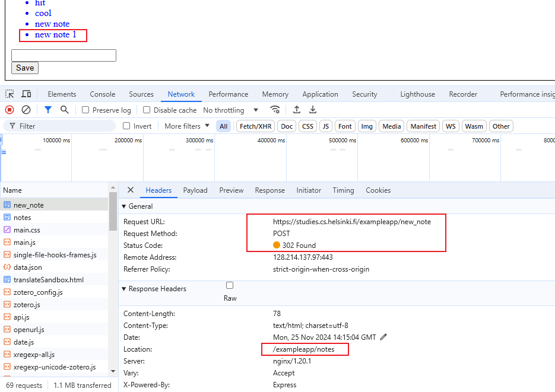
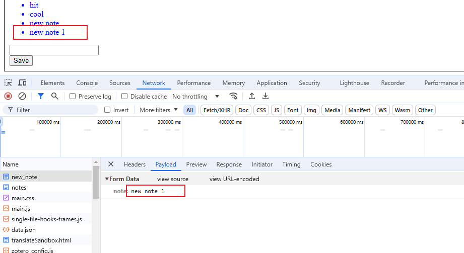
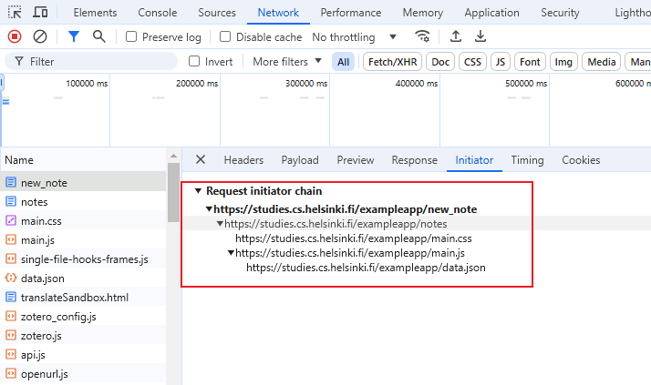
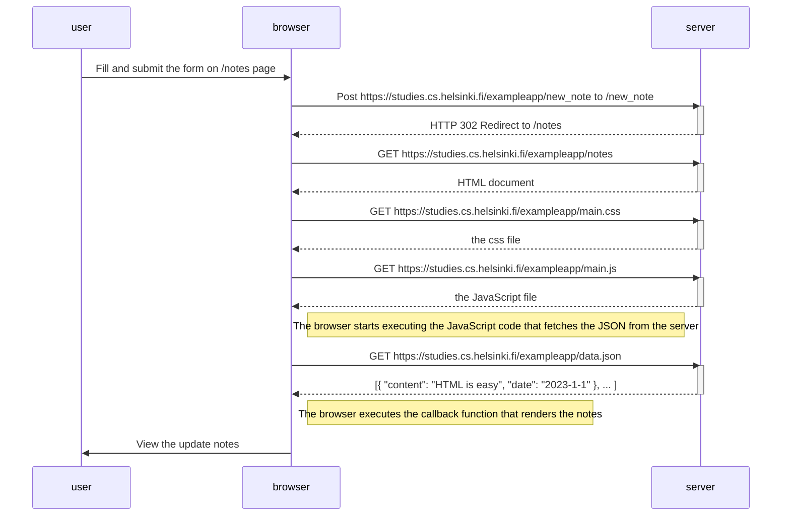

# New Note Diagram

Image 1: Post user's input to server

Image 2: User input

Image 3: Redirect to /notes

**New Note Diagram**

```mermaid
sequenceDiagram
    participant user
    participant browser
    participant server

    %% Image 2: User input
    user->>browser: Fill and submit the form on /notes page

    %% Image 1: Post user's input to server
    browser->>server: Post https://studies.cs.helsinki.fi/exampleapp/new_note to /new_note
    activate server
    %% Image 3: Redirect to /notes
    server-->>browser: HTTP 302 Redirect to /notes
    deactivate server


    browser->>server: GET https://studies.cs.helsinki.fi/exampleapp/notes
    activate server
    server-->>browser: HTML document
    deactivate server

    browser->>server: GET https://studies.cs.helsinki.fi/exampleapp/main.css
    activate server
    server-->>browser: the css file
    deactivate server

    browser->>server: GET https://studies.cs.helsinki.fi/exampleapp/main.js
    activate server
    server-->>browser: the JavaScript file
    deactivate server

    Note right of browser: The browser starts executing the JavaScript code that fetches the JSON from the server

    browser->>server: GET https://studies.cs.helsinki.fi/exampleapp/data.json
    activate server
    server-->>browser: [{ "content": "HTML is easy", "date": "2023-1-1" }, ... ]
    deactivate server

    Note right of browser: The browser executes the callback function that renders the notes

    browser->>user: View the update notes 
```

