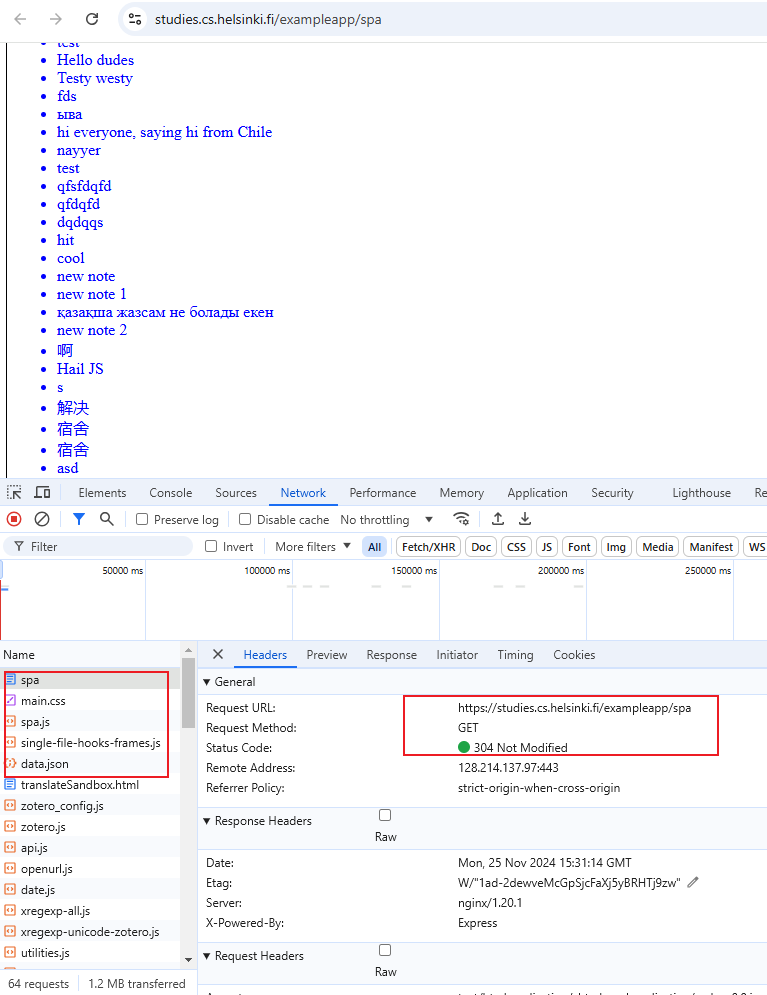
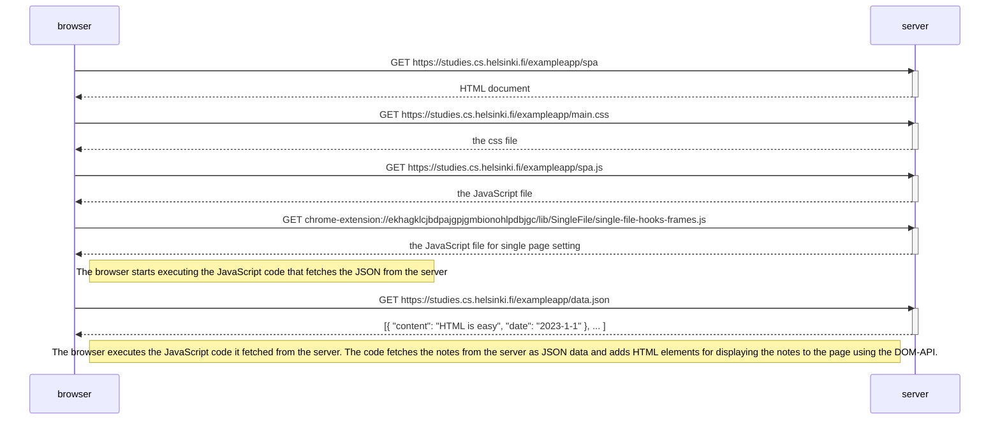

# Single page diagram

Image 1: The first access to the Single page app

**The First access to the Single Page app**

```mermaid
sequenceDiagram
    participant browser
    participant server

    browser->>server: GET https://studies.cs.helsinki.fi/exampleapp/spa
    activate server
    server-->>browser: HTML document
    deactivate server

    browser->>server: GET https://studies.cs.helsinki.fi/exampleapp/main.css
    activate server
    server-->>browser: the css file
    deactivate server

    browser->>server: GET https://studies.cs.helsinki.fi/exampleapp/spa.js
    activate server
    server-->>browser: the JavaScript file
    deactivate server

    browser->>server: GET chrome-extension://ekhagklcjbdpajgpjgmbionohlpdbjgc/lib/SingleFile/single-file-hooks-frames.js
    activate server
    server-->>browser: the JavaScript file for single page setting
    deactivate server

    Note right of browser: The browser starts executing the JavaScript code that fetches the JSON from the server

    browser->>server: GET https://studies.cs.helsinki.fi/exampleapp/data.json
    activate server
    server-->>browser: [{ "content": "HTML is easy", "date": "2023-1-1" }, ... ]
    deactivate server

    Note right of browser: The browser executes the JavaScript code it fetched from the server. The code fetches the notes from the server as JSON data and adds HTML elements for displaying the notes to the page using the DOM-API.
```