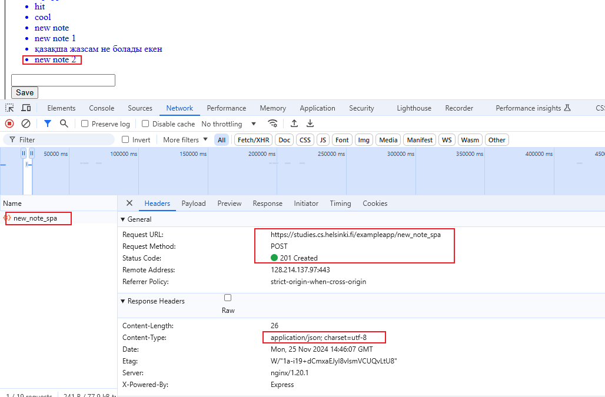
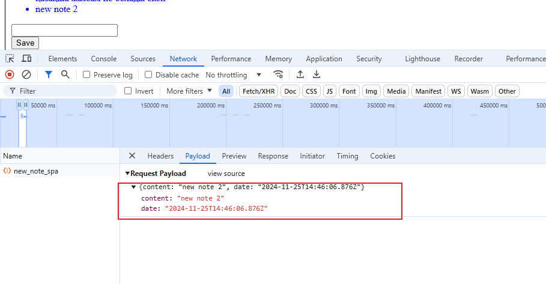
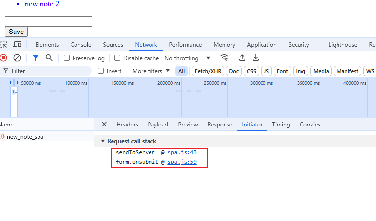
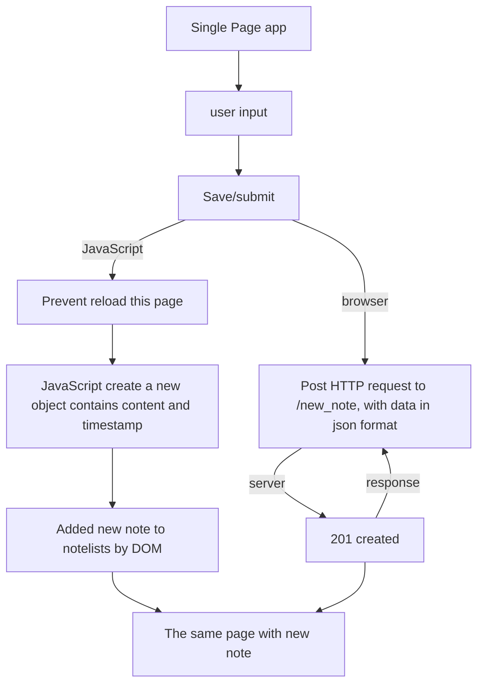

# Single Page app New Note Diagram

Image 1:HTTP request

Image 2: New object contains content and timestamp

Image 3: Request call stack

**Single Page app New Note Diagram**

```mermaid
  flowchart TD;
      A[Single Page app]--> B[user input];
      B--> C[Save/submit]
      C -- JavaScript --> D[Prevent reload this page]
      D -->E[JavaScript create a new object contains content and timestamp]
      E --> F[Added new note to notelists by DOM]
      F --> G[The same page with new note]
      C -- browser --> X[Post HTTP request to /new_note, with data in json format]
      X -- server --> Y[201 created]
      Y -- response --> X
      Y --> G
```

